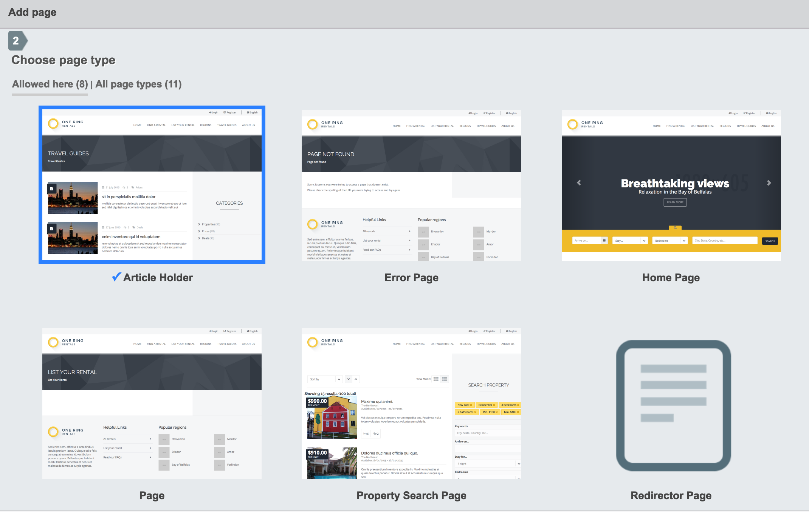

# Page Gallery for SilverStripe

This module makes creating pages in the CMS better. In like, every single way.

## Installation

`composer require unclecheese/silverstripe-page-gallery`

`cd silverstripe-page-gallery && npm install`

## OK, what does it do?

When adding a page in the CMS, the user is typically forced to parse a long list of ambiguous, developer-defined PHP class names in order to choose the page type that he or she wants. While the API offers configurations like `$singular_name` and `$description`, it can still be difficult to signal to a content editor exactly what a given page is used for.

I mean, really, `ConferenceEventPricingCategoryHolder`? Don't do me like that, bro.

Stop the madness. Let's just use auto-generated screenshots.

## Let's look



In addition to providing actual screenshots of each page type, the UI filters out page types that cannot be created in the section. Without this module, all of those page types are interpolated into the list, creating unnecessary visual noise and head-spinniness.

## The magic

Just run the task:

`framework/sake dev/tasks/PageGalleryTask`

A simple PhantomJS based library will take it from there.

## Excluding pages
So you don't want that `PlainTextPasswordPage` getting a screenshot? Just add it to the `exclude` list.
```yaml
UncleCheese\PageGallery\PageGalleryBuilder:
  exclude:
    - SomePage
```

## Specifying the instances of pages you want to get screenshots

By default, the screenshot task will get the last edited instance of a `SiteTree` object with `ClassName` equal to the page type. For more granular control, use `instance_map`.

```yaml
UncleCheese\PageGallery\PageGalleryBuilder:
  instance_map:
    Page: 'about-us'
    EventPage: 123
```

You can identify an instance by link or by ID.

## Full configuration

Configure the task:
```yaml
UncleCheese\PageGallery\PageGalleryBuilder:
  # width of the browser taking the screenshot
  screen_width: 1200
  # height of the browser taking the screenshot
  screen_height: 800
  # don't create screenshots for these pages.
  exclude:
    - VirtualPage
    - RedirectorPage
  # If you have a preference on what page gets the screenshot, map it to a link or ID
  instance_map:
    Page: 'about-us'
    EventPage: 123
  # Where the screenshots are saved. Recommend this is in source control
  project_screenshot_dir: 'mysite/images/screenshots'
```

There are also a few settings you can throw at the CMS UI.

```yaml
PageGalleryUI:
  # width of the screenshot in the gallery
  image_width: 300
  # height of the screenshot in the gallery
  image_height: 200
  # When no screenshot exists, use this default image
  default_image: 'silverstripe-page-gallery/images/default.png'
```

## Requirements

* SilverStripe > 3.1
* [npm](http://npmjs.org)
* The `node` binary must be in your PATH. (Hint: type `node -v` to get the verdict on that. If you get bad news, it's [exceedingly simple](https://docs.npmjs.com/getting-started/installing-node) to rectify)
* The `unclecheese/silverstripe-image-optionset` module. It's new in town.

## Open questions

Cause... talking to myself.

### Where should these screenshots go?

I think it makes sense to put them in a source-controlled part of your project, e.g. `mysite/images/screenshots`, but this raises a few questions, particularly around the write permissions on your `mysite/` directory, and the consequences of writing to a source-controlled directory in a non-development environment. `assets/` might make sense in that case, but that has the reverse problem of making it difficult for a developer to generate them locally and move them into staging and production `assets/` directories, because they're typically controlled by the users.

### The screenshot thingy should really be a pluggable service.

Indeed. It would make sense if a dev environment could inject a Node based screenshot grabber, and a staging environment could use a web service like [url2png](http://url2png.com), or what have you. The only issue with using a web service is that staging sites are often behind HTTP Auth.

### If a page doesn't exist in the tree, it kind of gets the shaft.

Potentially we could create a temporary one just for the screenshot, fill it with dummy content, then delete it?

# Tests

They exist.

# Troubleshooting

Ring Uncle Cheese.
